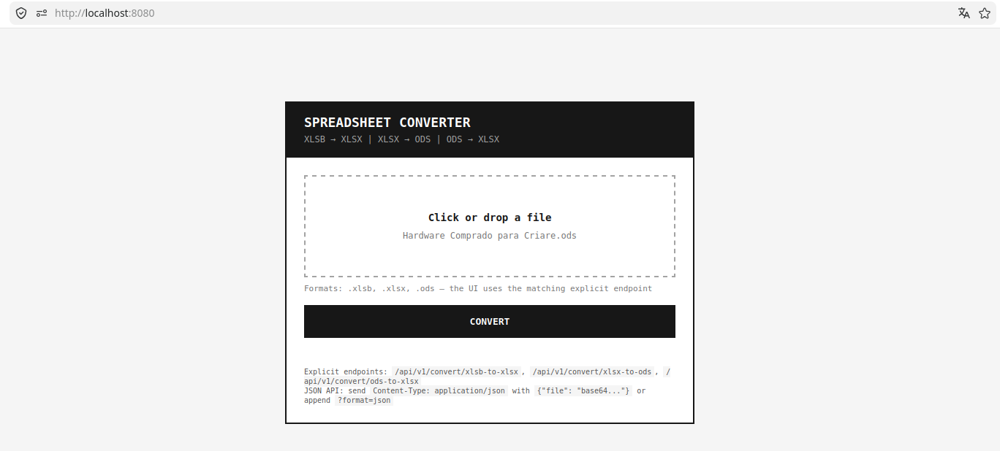

# office-converter

Servidor HTTP para conversão de planilhas entre os formatos **XLSB**, **XLSX** e **ODS** usando o LibreOffice em modo headless.

Implementação em Python 3 com [FastAPI](https://fastapi.tiangolo.com/) e [uvicorn](https://www.uvicorn.org/), executando dentro de uma imagem Docker baseada em `debian:12-slim`.



## Funcionalidades

- Endpoint inteligente com detecção automática de formato
- Endpoints explícitos e tipados para integrações confiáveis
- Interface web com arrastar e soltar
- Dois estilos de API: `multipart/form-data` (retorna o arquivo) e `application/json` com base64 (retorna JSON)
- Totalmente configurável via variáveis de ambiente — veja [`env.example`](env.example) para um modelo documentado
- Pronto para Docker e Kubernetes (endpoint de health check)
- Limite de 100 MiB, 2 slots de conversão concorrente (controlado via `asyncio.Semaphore`; worker único do uvicorn)
- Documentação interativa da API em `/docs` (Swagger UI) e `/redoc`

## Quick Start

### Docker (recomendado)

```bash
docker build -t office-converter .
docker run --rm -p 8080:8080 office-converter
```

Para passar configurações via arquivo de variáveis de ambiente:

```bash
cp env.example .env   # edite conforme necessário
docker run --rm -p 8080:8080 --env-file .env office-converter
```

Acesse `http://localhost:8080` no navegador.

### Desenvolvimento local (uvicorn)

Requer Python 3.11+, `soffice` no `PATH` e as dependências instaladas:

```bash
pip install -r requirements.txt
make serve
# ou
OFFICE_PORT=8080 python3 -m uvicorn app.main:app --host 0.0.0.0 --port 8080 --reload
```

## Endpoints da API

| Método | Caminho                         | Descrição                                    |
|--------|---------------------------------|----------------------------------------------|
| POST   | `/api/v1/convert`               | Endpoint inteligente (detecta a direção)     |
| POST   | `/api/v1/convert/xlsb-to-xlsx`  | `.xlsb` → `.xlsx`                            |
| POST   | `/api/v1/convert/xlsx-to-ods`   | `.xlsx` → `.ods`                             |
| POST   | `/api/v1/convert/ods-to-xlsx`   | `.ods` → `.xlsx`                             |
| GET    | `/healthz`                      | Health check                                 |
| GET    | `/docs`                         | Swagger UI (documentação interativa)         |
| GET    | `/redoc`                        | ReDoc (referência legível da API)            |
| GET    | `/openapi.json`                 | Schema OpenAPI 3 bruto                       |

## Documentação

| Guia | Descrição |
|------|-----------|
| [DOCUMENTS/README.md](DOCUMENTS/README.md) | Referência completa: variáveis de ambiente, Docker, Makefile |
| [DOCUMENTS/curl.pt-BR.md](DOCUMENTS/curl.pt-BR.md) | Exemplos com `curl` |
| [DOCUMENTS/axios.pt-BR.md](DOCUMENTS/axios.pt-BR.md) | Exemplos com Axios (Node.js) |
| [DOCUMENTS/postman.pt-BR.md](DOCUMENTS/postman.pt-BR.md) | Guia de configuração do Postman |
| [DOCUMENTS/postman_collection.json](DOCUMENTS/postman_collection.json) | Collection do Postman pronta para importar |
| [DOCUMENTS/scripts/README.md](DOCUMENTS/scripts/README.md) | Scripts de testes de integração |

---

Also available in [English](README.md).
